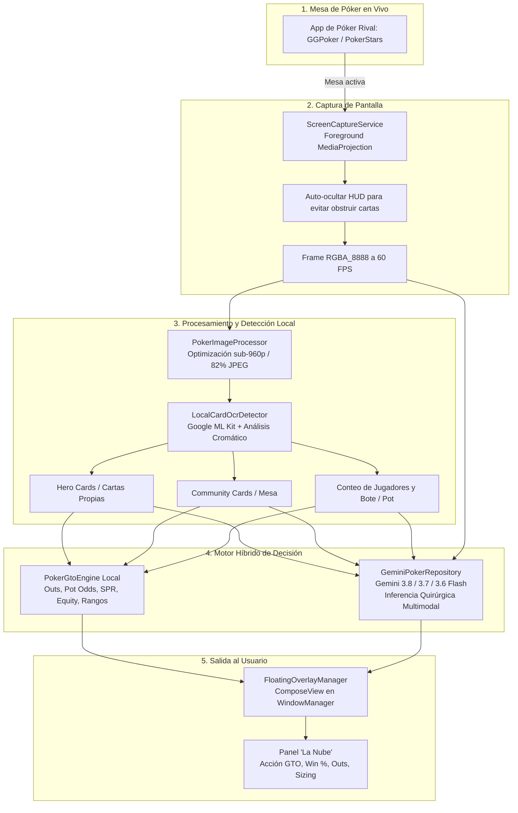

# ♠️ Poker GTO Vision AI 🃏

> **Asesor de Póker Texas Hold'em en Tiempo Real con Visión Artificial y Google Gemini AI (Ultra Baja Latencia).**

**Poker GTO Vision** es un sistema móvil avanzado diseñado para asistir a jugadores de póker en tiempo real mientras juegan en plataformas como GGPoker, PokerStars, CoinPoker, WPT Global o mesas virtuales.

El sistema utiliza una arquitectura híbrida única: combina **captura de pantalla continua**, **OCR local en el dispositivo** (Google ML Kit + análisis cromático), un **motor matemático GTO determinista** local y la inteligencia multimodal de **Google Gemini Serie 3 Flash** (`gemini-3.8-flash`, `gemini-3.7-flash` y `gemini-3.6-flash`), proyectando los resultados directamente sobre la mesa de juego mediante un **HUD flotante interactivo** (*Overlay*).

---

## 🏗️ Arquitectura del Sistema



---

## 🌟 Características Principales

### 1. 🔍 Detección Visual Híbrida de Mesa (OCR Local + Visión)
* **Google ML Kit Text Recognition:** Extrae textos clave, valores de apuestas, tamaño del bote (`Pot: $XX`, `XX BB`) y posiciones de los jugadores.
* **Análisis Cromático de Baraja de 4 Colores:** Distingue con exactitud palos estándar y barajas de cuatro colores (Picas = Negro, Corazones = Rojo, Diamantes = Azul, Tréboles = Verde).
* **Agrupación Espacial Inteligente:**
  * **Cartas Comunitarias (*Board*):** Detectadas en la zona central de la mesa ($y \in 30\% \dots 65\%$).
  * **Cartas del Jugador (*Hole Cards*):** Identificadas en el área inferior del jugador ($y > 55\%$) en parejas adyacentes.
  * **Deduplicación Física por Posición X:** Soporta con precisión manos con tríos o parejas en la mesa (ej. $A\spadesuit A\heartsuit A\diamondsuit$) sin descartarlas por duplicación errónea.

### 2. 🧮 Motor Matemático GTO Determinista Local (`PokerGtoEngine`)
* **Tablas de Rangos Preflop:** Ajustadas según posición (*UTG, MP, CO, BTN, SB, BB*) y número de jugadores en mesa (2 a 9).
* **Cálculo de Outs y Proyectos Postflop:**
  * Proyectos de color (*Flush Draw*): 9 outs.
  * Proyectos de escalera abierta (*OESD*): 8 outs.
  * Escalera interna (*Gutshot*): 4 outs.
  * Cartas superiores (*Overcards*): 3 a 6 outs.
* **Métricas de Valor Esperado:**
  * *Pot Odds* (Razón de bote)
  * *Stack-to-Pot Ratio (SPR)*
  * *Win Rate %* (Equity)
  * Recomendación de sizing exacto (*Check, Fold, Call, Raise 2.5x, Bet 33%, Bet 67%, All-in*).

### 3. ⚡ Inteligencia Artificial Multimodal con Google Gemini Serie 3 Flash
* **Modelos Integrados en Cascada de Ultra Baja Latencia:**
  1. `gemini-3.8-flash` (Prioridad principal)
  2. `gemini-3.7-flash` (Respaldo directo)
  3. `gemini-3.6-flash`
  4. `gemini-2.5-flash` / `gemini-2.0-flash`
* **Prompt Quirúrgico Especializado:** Formulado para devolver respuestas JSON instantáneas analizando el estado de la mano, la textura del tablero (seco, húmedo, monocolor) y las líneas de acción de los rivales.
* **Compresión Adaptativa:** Escala los fotogramas a resolución óptima ($\le 960\text{px}$) y calidad JPEG 82% con decodificación greedy (`temperature = 0.0`), logrando respuestas en tiempos menores a 1 segundo.

### 4. 🪟 HUD Flotante sobre la Pantalla (`FloatingOverlayManager`)
* **Botón Flotante Disparador (*Trigger*):** Un icono flotante compacto y arrastrable que permanece visible sobre cualquier aplicación de póker.
* **Auto-ocultamiento al Capturar:** Cuando el usuario pulsa para analizar, el HUD se hace 100% transparente en el microsegundo de la captura para que no tape las cartas de la mesa ni el bote.
* **Panel de Resultados (*"La Nube"*):**
  * Badge de Acción GTO con colores semánticos (Verde = Call/Check, Naranja = Raise, Rojo = Fold, Violeta = All-in).
  * Porcentaje de victoria (*Equity*).
  * Conteo de Outs y explicación táctica.
  * Confirmación visual de las cartas detectadas en mesa y mano.

### 5. 🎮 Simulador de Mesa Texas Hold'em Integrado (`PokerTableSimulator`)
* Permite probar estrategias y evaluar manos sin necesidad de abrir una mesa real.
* Incluye botones de presets rápidos:
  * *Pocket Aces* ($A\spadesuit A\heartsuit$)
  * *Monstruo Preflop* ($A\spadesuit K\heartsuit$ Suited)
  * *Set en el Flop* ($7\spadesuit 7\heartsuit$ en mesa $7\diamondsuit K\clubsuit 2\spadesuit$)
  * *Nut Flush Draw* (Proyecto de color máximo)
  * *Farol en el River* (*River Bluff Opportunity*)
* Control manual de cartas, jugadores, bote y calle (*Preflop, Flop, Turn, River*).

### 6. 🎨 Interfaz Moderna en Jetpack Compose
* **Diseño Profesional:** Fondos minimalistas limpios, bordes definidos, geometría animada con líneas de pulso degradadas.
* **Soporte Tema Oscuro y Tema Claro:** Conmutación instantánea mediante `AppThemeManager`.
* **Gestor de Llave API (`ApiKeyManager`):** Configuración segura y almacenamiento cifrado local de la API Key de Google Gemini.

---

## 📂 Estructura del Proyecto

```
Gto/
│
├── PokerGTO.apk                       # Ejecutable instalable final (Android APK)
├── ejecutar_en_dispositivo.bat        # Lanzador para instalar y abrir la app con 1 clic
├── run.ps1                            # Script PowerShell que gestiona la conexión ADB
├── abrir_en_android_studio.bat        # Lanzador para abrir el proyecto en Android Studio
│
├── app/
│   ├── build.gradle.kts               # Configuración de compilación Android (SDK 36, KSP, Compose)
│   ├── proguard-rules.pro             # Reglas de optimización ProGuard/R8
│   └── src/main/
│       ├── AndroidManifest.xml        # Permisos (MediaProjection, Overlay, Internet)
│       └── java/com/example/
│           ├── MainActivity.kt        # Actividad principal y solicitud de permisos
│           │
│           ├── data/                  # Capa de Datos y Motores de Cálculo
│           │   ├── ApiKeyManager.kt        # Almacén seguro de claves Gemini
│           │   ├── GeminiPokerRepository.kt# Cliente Ktor HTTP y cascada de modelos Gemini 3.8/3.7/3.6
│           │   ├── GTOStateManager.kt      # Gestor de estado de mesa y calles
│           │   ├── PokerGtoEngine.kt       # Motor matemático GTO y evaluador de manos
│           │   └── PokerModels.kt          # Modelos de datos (PokerCard, GtoAction, etc.)
│           │
│           ├── service/               # Servicios en Segundo Plano y Visión
│           │   ├── ScreenCaptureService.kt   # Foreground Service con VirtualDisplay
│           │   ├── PokerImageProcessor.kt    # Procesamiento y compresión de imagen
│           │   ├── LocalCardOcrDetector.kt   # OCR ML Kit y clustering de cartas
│           │   ├── FloatingOverlayManager.kt # HUD flotante en WindowManager
│           │   └── ServiceLifecycleOwner.kt  # Ciclo de vida para Compose en Service
│           │
│           └── ui/                    # Interfaz de Usuario (Jetpack Compose)
│               ├── PokerScreen.kt            # Pantalla principal completa
│               ├── MainPokerScreen.kt        # Dashboard de análisis
│               ├── PokerViewModel.kt         # Arquitectura MVVM
│               ├── components/
│               │   ├── BackgroundGeometry.kt # Fondo geométrico animado
│               │   ├── BottomActionBar.kt    # Barra inferior de controles
│               │   ├── GtoHudCard.kt         # Tarjeta de recomendación GTO
│               │   ├── PokerCardView.kt      # Renderizado de naipes y baraja
│               │   ├── PokerHudOverlay.kt    # Componentes visuales del HUD
│               │   ├── PokerTableSimulator.kt# Simulador offline interactivo
│               │   └── SemanticComponents.kt # Badges y chips de estado
│               ├── overlay/
│               │   ├── FloatingHudState.kt   # Estado reactivo del overlay
│               │   └── FloatingPokerHud.kt   # Layout Compose del overlay flotante
│               └── theme/
│                   ├── AppThemeManager.kt    # Manejo de tema Claro / Oscuro
│                   ├── Color.kt              # Paleta de colores HSL / Semántica
│                   ├── Theme.kt              # Configuración Material 3
│                   └── Type.kt               # Tipografía y estilos
│
├── gradle/                            # Versiones y dependencias (Gradle 9.3.1)
├── local.properties                   # Ruta del Android SDK local
└── settings.gradle.kts                # Repositorios y módulos
```

---

## 🚀 Cómo Ejecutar la Aplicación

### Método 1: En tu Teléfono Android (Vía USB)
1. Conecta tu celular a la PC con un cable USB.
2. Activa **Depuración USB** en *Ajustes > Opciones de Desarrollador*.
3. Haz doble clic en el archivo:
   ```cmd
   ejecutar_en_dispositivo.bat
   ```
4. El script detectará tu celular, instalará el APK y abrirá la aplicación automáticamente.

---

### Método 2: En un Emulador para PC (BlueStacks, LDPlayer, MuMu o WSA)
1. Abre tu emulador de Android favorito en Windows.
2. Arrastra el archivo **`PokerGTO.apk`** dentro de la ventana del emulador.
3. La aplicación se instalará al instante y podrás usarla con el ratón.

---

### Método 3: Desde Android Studio
1. Haz doble clic en **`abrir_en_android_studio.bat`**.
2. Espera a que Android Studio cargue el proyecto.
3. Presiona el botón verde **Run ▶️** para ejecutar en el emulador oficial de Android Studio o inspeccionar los componentes en tiempo real.

---

## 🛠️ Tecnologías y Dependencias

| Componente | Tecnología |
| :--- | :--- |
| **Lenguaje** | Kotlin 2.2 |
| **UI Framework** | Jetpack Compose (Material 3) |
| **Arquitectura** | MVVM + Clean Architecture + StateFlow Coroutines |
| **Visión Artificial** | Google ML Kit Text Recognition |
| **IA Multimodal** | Google Gemini API (`gemini-3.8-flash`, `gemini-3.7-flash`) |
| **Networking** | Ktor HTTP Client (Engine Android) + Kotlinx Serialization |
| **Captura de Pantalla** | Android MediaProjection API + VirtualDisplay + ImageReader |
| **Overlay Flotante** | Android `WindowManager` con `SYSTEM_ALERT_WINDOW` |
| **Build System** | Gradle 9.3.1 con Android Gradle Plugin 8.9 |

---

## 🔒 Permisos Requeridos en Android

* `android.permission.INTERNET`: Comunicación con la API de Google Gemini.
* `android.permission.FOREGROUND_SERVICE`: Mantener el servicio de captura activo mientras juegas.
* `android.permission.FOREGROUND_SERVICE_MEDIA_PROJECTION`: Captura de pantalla de la mesa.
* `android.permission.SYSTEM_ALERT_WINDOW`: Dibujar el HUD flotante sobre otras aplicaciones de póker.
* `android.permission.POST_NOTIFICATIONS`: Notificación del servicio en primer plano (Android 13+).
