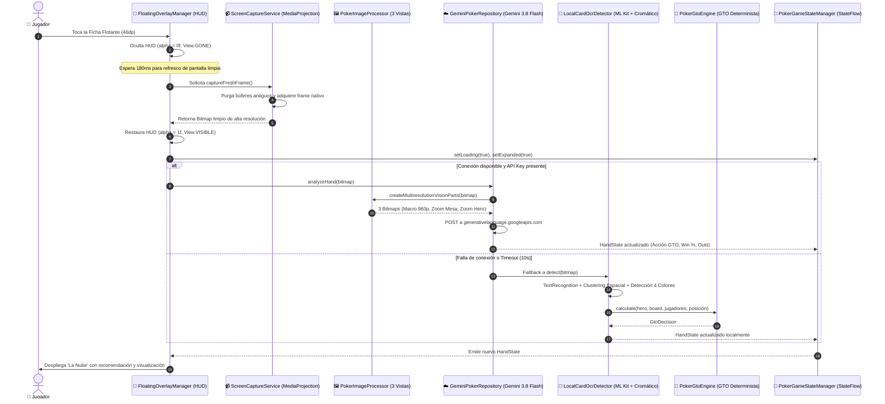

# 🏛️ 01. Arquitectura del Sistema y Flujo de Visión

## 1. Visión General y Propósito

**Poker GTO Vision AI** es un asistente táctico en tiempo real para Texas Hold'em en dispositivos Android. Su arquitectura resuelve tres desafíos técnicos críticos en el póker móvil:

1. **No ser detectado ni obstruir la mesa:** La aplicación no interfiere con el código ni la memoria de la aplicación de póker (GGPoker, PokerStars, CoinPoker, etc.). Funciona como un observador visual puro usando `MediaProjection` y proyecta los resultados con una ventana flotante transparente (`WindowManager`).
2. **Evitar tapar las cartas al capturar (*Anti-Occlusion*):** El HUD flotante se auto-oculta haciéndose invisible (`alpha = 0f`, `View.GONE`) en el microsegundo previo a capturar el fotograma. Un retraso controlado de 180 ms garantiza que la GPU de Android renderice la mesa completamente limpia antes de adquirir la imagen del `ImageReader`.
3. **Inferencia Híbrida de Ultra-Baja Latencia:** Combina la potencia multimodal de **Google Gemini 3.8 Flash** con un motor de visión local determinista (**Google ML Kit + OCR cromático**) para responder en menos de 1 segundo incluso con fluctuaciones de red.

---

## 2. Diagrama de Flujo del Pipeline

---

## 3. Componentes Fundamentales

### 1. Capturador Limpio (`ScreenCaptureService`)
- Implementado como un **Foreground Service** con tipo `mediaProjection`.
- Utiliza un `VirtualDisplay` asociado a un `ImageReader` configurado en `PixelFormat.RGBA_8888`.
- El método `captureFreshFrame()` ejecuta una purga en bucle de fotogramas residuales para garantizar que no se tome un fotograma donde el overlay aún estuviese dibujado.

### 2. HUD Flotante (`FloatingOverlayManager`)
- Gestiona una vista `ComposeView` anclada a `WindowManager` con los parámetros `TYPE_APPLICATION_OVERLAY`.
- Implementa gestos táctiles de arrastre con física de adherencia al borde de la pantalla (*snap-to-edge*).
- Soporta arrastre hacia abajo para eliminar el overlay (*Chat-Head drag-to-trash*).
- Implementa `ServiceLifecycleOwner` para dar soporte al ciclo de vida de Jetpack Compose dentro de un servicio.

### 3. Orquestador de Datos (`PokerGameStateManager`)
- Actúa como la **Única Fuente de la Verdad (Single Source of Truth)**.
- Expone un `StateFlow<HandState>` inmutable que sincroniza en tiempo real:
  - La pantalla principal de la aplicación.
  - El panel desplegable del overlay flotante.
  - El simulador de mesa de póker.
